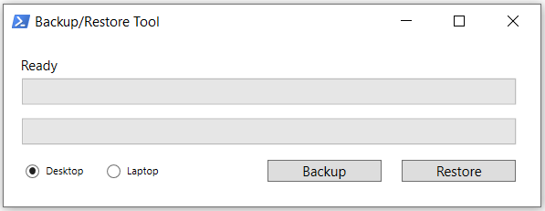

# profile-backup-and-restore
This is a script that backs up a Windows user profile folders and the currently connected network printers to any specified directory.

**Disclaimer:** *The author of this script will not be liable of any damage or data loss when using this script. Please test and study the script first before using it in a production environment.*

## Features
* Backs up folders from the current user profile
* Restores folders from backup directory
* Backs up and restores network printers
* Split progress bar per folder and overall process
* Displays current processing folder and remaining data in GB
* Uses Windows Presentation Foundation
* Uses multi-threading for UI and backend process
* Uses robocopy for backup process which parameters can be easily changed
* Able to backup on different directories - choose between desktop or laptop
* Script cancellation with process handling
* Exit script confirmation

## Requirements
* Windows 7 or higher
* PowerShell v4 or higher
* .Net Framework 4.5 or higher

## How to use
1. Change the following variables in the backup runspace depending on your setup:
   * **Line 110** - destination folder in the backup drive for Desktop backups. Default: H:\\**_BACKUP**
   * **Line 112** - destination folder in the backup drive for Laptop backups. Default: H:\\**_LaptopBackup**
   * **Line 199** - list of folders in the source directory that will be included in the backup
   * **Line 200** - backup drive letter
   * **Line 225** - source directory structure. Default: **_$env:USERPROFILE_**\\dir
   * **Line 226** - destination directory structure. Default: $backupDrive\\$($syncHash.destDir)\\**_$env:USERNAME_**\\$dir
   * **Line 243** - this corresponds to the parent folder in Line 226. Default: backupDrive\\$($syncHash.destDir)\\**_$env:USERNAME_**
1. Change the following variables in the restore runspace depending on your setup:
   * **Line 259** - this is the same as the folder in Line 110
   * **Line 262** - this is the same as the folder in Line 112
   * **Line 354** - this is the same as the folder in Line 199
   * **Line 355** - this is the same as the drive letter in Line 200
   * **Line 363** - this is the destination for the restore operation. Default: **_$env:USERPROFILE_**\\$dir
   * **Line 364** - this is the backup source where the backed up files are. Default: $backupDrive\\$($syncHash.srcDir)\\**_$env:USERNAME_**\\$dir
1. Run the script using PowerShell (right click > run with PowerShell) or open with Powrshell ISE then run from there. **Note:** This is intended to be used by your users, you can store this somewhere in your file shares and teach them how to use it.
1. *Optional:* If you want to exclude the printers for the backup and restore operations, comment out the following lines:
   * **Restore** - Lines 376-385
   * **Backup** - Lines 207-221
   
## Troubleshooting
1. If you want to see the existing values in the synced hashtable, comment out lines 426-431

## Want to use this in your organization?
I can convert this script to an EXE file. Drop me an email here: peterjoseph.rivera@gmail.com
